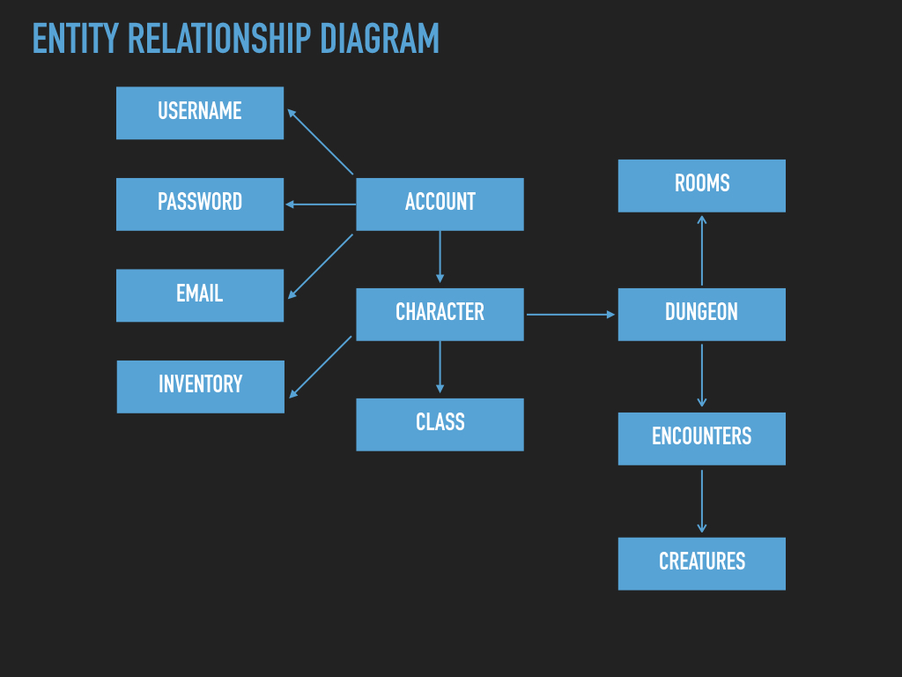

 ApiDnD 
===


## Overview

A command line Dungeons and Dragons text adventure! Immerse yourself in the Tomb of Horrors, a vast and terrible crypt full of treasure and traps. If you're brave and lucky, you may leave a rich man. If not, you'll be dead. 
#### The user can:
 * Create a character with an associated account
 * Level up your character as you succeed and more and more difficult trials
 * Traverse a vast text landscape
 * Obtain weapons, potions, and spells
 * Obtain treasures and other loot
 * Battle creatures that vary in difficulty and scale with the progression of the character
 * Save the game and access your character and progress later on
 
The game utilizes real D&D creatures accessed from our own api, along with character input to generate a D&D style dungeon complete with random enemy encounters, boss battles, skill rolls, and character progression.


## Usage
#### Prerequisites:

You must have **NodeJS** installed along with **NPM** and **MongoDB**. 

##### So, you want to play some API DnD? Here’s how you do it. 

1 - Fork / Clone / Download this repo.

2 - from the folder you cloned into, run
```
npm -i
``` 


3 - You will need 3 terminal windows open to play the game, so get those ready now.

4 - Once the dependencies are installed, open one of your other terminal windows and run: 
```
npm run dbOn
``` 
This will fire up the mongo database needed to run the game and house your character.

5 - In the first terminal window you had open type the following at the command prompt.
```
node main.js
``` 
This will start start the server and you should see 
```
Server is up on PORT 3000
```

6 - In the third and final terminal window you’ll enter all of your information
	
* first - create an account with the following command: 
```
HTTP POST localhost:3000/api/signup username:<enter name here> password:<enter password here>
```  
and hit return.

You should get a response with an ID and a token. Keep that ID handy, you’ll need it for the following commands!

* second - Let’s show where you are in the dungeon: 
```
HTTP PUT -a <username>:<password> localhost:/3000/api/status
```

This will show you your character stats, and the description of the current room. See that text that is in the [ ] ? That is where you can move to! Let’s do that now! 

 ```
 HTTP PUT -a <username>:<password> localhost:3000/api/move/Fresco
 ```

You’ll now get a new room and the other connecting rooms (in the [ ] ). 

Let’s get you into a quick battle! Type the following: 
```
HTTP PUT -a <username>:<password> localhost:3000/api/move/Gargoyle
```

This will bring up the combat phase! To enter combat you type the following:

```
HTTP PUT -a <username>:<password> localhost:/3000/fight/confirm/<YOUR ID>
```
Combat will ensue! How did it turn out for you? You can continue to traverse the dungeon with the same commands as before!

You are also able to flee from combat by sending the same PUT request to:

```
localhost:3000/api/run/<YOUR ID>
```

## Running the tests

* Account authentication tests (proper status codes and tokens)
* Combat test (basic combat functionality)
* Creature tests (creating real D&D creature)
* Dice test (simulating real D&D dice rolls)
* Dungeon traversal (moving the character object through the dungeon)
* Encounter (producing a random monster)
* Gameplay (moving the character through the dungeon and engaging in battle)
* Traps (functionality for detecting, being hit by, and disarming traps)
* User Interaction (the full game play, from character creation to monster encounters in the dungeon)

##### To run all tests, first make sure your mongo database is running:
```
npm run dbOn
```
##### then run the test script:

```
npm run test
```

## ERD



## Built With

* [NodeJS](https://nodejs.org) - The javascript runtime used
* [Jest](https://jestjs.io/) - Testing platform used
* [Eslint](https://eslint.org/) - Coding style linter
* [Superagent](https://visionmedia.github.io/superagent/) - AJAX with less suck!
* [Winston](https://www.npmjs.com/package/winston) - One seriously awesome logging tool
* [Express](https://www.npmjs.com/package/express) - A robust and versatile tool for creating servers
* [Faker](https://www.npmjs.com/package/faker) - A useful package for generating fake test data
* [Body Parser](https://www.npmjs.com/package/body-parser) - A middleware tool for parsing requests
* [MongoDB](https://www.mongodb.com/) - A dynamic database
* [Mongoosejs](https://www.npmjs.com/package/mongoose) - An asynchronous object modeling tool
* [Jsonwebtoken](https://jwt.io/) - Tool for industry standard method for securely representing claims between two parties
* [Bcrypt](https://www.npmjs.com/package/bcrypt) - A useful tool for hashing passwords


## Authors

[**Tyler Anyan**](https://github.com/tganyan) | [**Tom North**](https://github.com/tnorth93) | [**Diego Ramos**](https://github.com/diego-ramos130) | [**Daniel Frey**](https://github.com/fncreative) | [**Wyatt Peffley**](https://github.com/peffles)

## License

This project is licensed under the MIT License - see the [LICENSE.md](LICENSE.md) file for details
